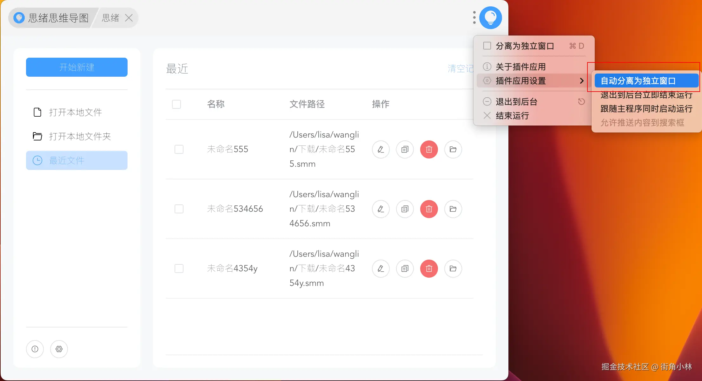

# Client

## Independent Client

This project also provides a client version using [Electron](https://www.electronjs.org/) Development. Supports 'Windows', 'Mac', and 'Linux'.

Function Introduction:

1. Support creating and opening files for editing;

2. Support viewing the list of recently edited files;

3. Support the copying, deletion, and renaming of files;

`The v0.13.1+` version has added the following features:

1. Support deleting multiple files, including deleting source files and deleting from lists;

2. Support opening specified directories and automatically scanning mind map files in the directory. Generally speaking, we will put all relevant mind map files in the same directory, so with this function, it is easy to switch to other files in the same directory for editing;

3. The main interface also supports dark mode, and the settings have added options for setting dark mode;

### Download

> The client version may lag behind the online version. To try new features, please prioritize using the online version.

You can directly download the corresponding client for installation and use, and two download addresses are provided:

1.[Github](https://github.com/wanglin2/mind-map/releases)

2.[Baidu cloud disk](https://pan.baidu.com/s/1huasEbKsGNH2Af68dvWiOg?pwd=3bp3)

### Development

If necessary, you can also conduct secondary development.

#### clone

```bash
git clone https://github.com/wanglin2/mind-map.git
cd mind-map
git checkout electron
```

#### Start serve

Execute in the project root directory:

```bash
cd simple-mind-map
npm i
npm link
cd ..
cd web
npm i
npm link simple-mind-map
npm run electron:serve
```

#### Packaging client

You need at least two computers, one 'Windows' and one 'Mac'.

Packaging 'Windows' application:

```bash
npm run electron:build-win
```

Packaging 'Mac' application:

```bash
npm run electron:build-mac
```

Packaging 'Linux' application:

```bash
npm run electron:build-linux
```

Packaging all applications:

```bash
npm run electron:build-all
```

Automatically pack according to your computer system:

```bash
npm run electron:build
```

## uTools plugin

The `uTools` plugin inherits all the functions of an independent client and also adds the following features:

1. Support deleting multiple files, including deleting source files and deleting from lists;

2. Support opening specified directories and automatically scanning mind map files in the directory. Generally speaking, we will put all relevant mind map files in the same directory, so with this function, it is easy to switch to other files in the same directory for editing;

3. The main interface also supports dark mode, and the settings have added options for setting dark mode;

### Install

#### Install uTools

If you have already installed `uTools`, you can ignore this step.

Installing `uTools` is very simple. Open its official website, download the file, and then follow the steps to install it.

Official website: [https://www.u.tools/](https://www.u.tools/)

#### Install the Mind Mapping Plugin

After installing `uTools`, you should be able to see its icon on the status bar of your computer.

You can directly access this address: [Homepage](https://www.u-tools.cn/plugins/detail/%E6%80%9D%E7%BB%AA%E6%80%9D%E7%BB%B4%E5%AF%BC%E5%9B%BE/), Click the 'Start' button on the right to proceed with the installation.

You can also use the 'ALT+Space' key to bring up its search box on any interface, and then enter the plugin app store:


Enter 思绪 and search to find the Mind Map plugin:


Click the 【获取】 button on the right to install.


After installation, you can click on 【打开】 to enter the usage mode~

To use it in the future, simply use the `ALT+Space` keys to call up the search box, enter 【思绪】, and press enter to open it:


#### Use tips

1.Set to automatically separate into independent windows



In this way, the next time you open it, it will open as a separate window. If you have resized the window before, it will be displayed as the previous size by default when you open it again, instead of manually adjusting it every time.

2.Close the Super Panel

When editing a mind map, selecting multiple nodes is done by holding down the right mouse button and dragging to select boxes. This conflicts with the super panel function of uTools, resulting in the inability to select boxes, as shown below:


So it is recommended to disable this feature or modify its triggering method. Set the path to: click on the avatar on the right side of the search box to enter the personal center ->click on the personal center in the bottom left corner ->click on settings ->close the super panel.