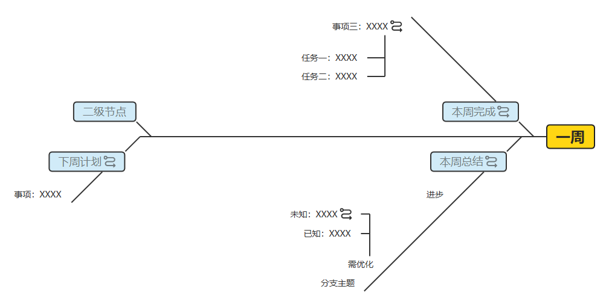
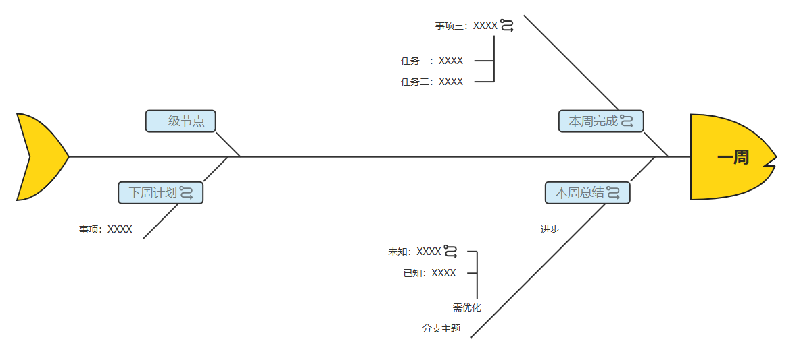

# RightFishbone chargeable plugin

> Compatible with simple-mind-map of v0.14.0 and above.

The RightFishbone plugin is used to provide a layout structure for the right fishbone diagram, including two types: regular and with fish head and tail shapes:

<p style="display:flex;align-items: flex-end;">





</p>

You can switch between the 'Structure' list in the online version to experience it.

## Charge

Please switch to the Chinese documentation for this plugin to view.

## Register

1.Referencing packaged files:

```js
import MindMap from 'simple-mind-map'
import RightFishbone from 'rightFishbone.cjs.min.js'
// 或 import RightFishbone from 'rightFishbone.esm.min.js'

MindMap.usePlugin(RightFishbone)
```

2.Referencing Unpackaged Source Code

You can first enter the plugin directory to execute:

```bash
npm link
```

Then enter your project root directory to execute:

```bash
npm link simple-mind-map-plugin-right-fishbone
```

Then you can directly import it for use:

```js
import MindMap from 'simple-mind-map'
import RightFishbone from 'simple-mind-map-plugin-right-fishbone'

MindMap.usePlugin(RightFishbone)
```

After registration and instantiation of `MindMap`, the instance can be obtained through `mindMap.rightFishbone`.

## Usage

After registering the plugin, it can be used directly. You can input the structure when instantiating the mind map:

- `rightFishbone`: Ordinary right-handed fishbone diagram

- `rightFishbone2`Fish bone diagram with fish head and tail shape

Example:

```js
const mindMap = new MindMap({
    layout: 'rightFishbone2'
})

// Dynamic switching
mindMap.setLayout('rightFishbone')
```