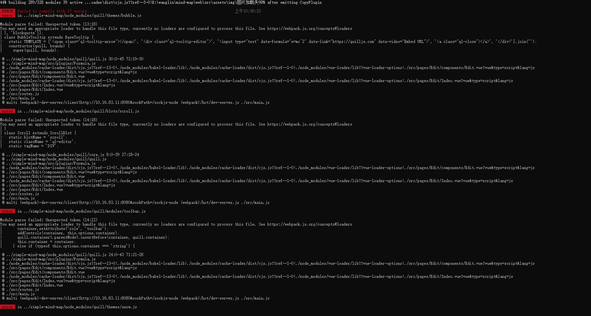

# Questions

## 1.Error when using in Vite, indicating xml-js dependency error

Solution: use the following import method:

```js
import MindMap from "simple-mind-map/dist/simpleMindMap.umd.min";
```

The `simple-mind-map` package provides the unpacked entry field `module`, and
the `xml-js` package dependency needs to import the package in the `node`
environment. Therefore, it cannot be obtained in `Vite` and an error will be
reported. Therefore, specify the import of the packed entry, and all relevant
packages are packed into the product, so there will be no error.

If you need to do further development, that is, you must use the unpacked code,
and if you do not need to parse the `xmind` file, you can remove the `xmind`
module. If you need it, you can try using other libraries to parse `xml` to
`json`.

## 2.Error `Getting bbox of element "text" is not possible: TypeError: Cannot read properties of undefined (reading 'apply')`

The reason is that the installed version of `@svgdotjs/svg.js` is too high. You can manually reduce it to the version of `3.0.16`.

## 3.TypeError: Cannot read properties of undefined (reading 'prototype') at sax.js:222:46 

The following configurations can be added to the packaging configuration file:

```js
resolve: { alias: { stream: "stream-browserify" } }
```

Different packaging tools may have different specific configurations, with the principle of excluding 'stream' dependencies.

## 4.When clicking the [New], [Open], or [Save As] buttons, it will prompt that the browser does not support it or is not using the HTTPS protocol.

The browser uses API [window.showOpenFilePicker](https://developer.mozilla.org/zh-CN/docs/Web/API/Window/showOpenFilePicker) to operate local files on the computer. If it is not supported, either the browser does not support this API or the page is not using the HTTPS protocol, You can press F12, or open the browser console through the right-click menu on the page and enter 'window.showOpenFilePicker' in the 'Console' tab. If it returns 'undefined', it means it is not supported. If it does not return this message and the page still prompts that the browser does not support it or is not using the HTTPS protocol, you can submit an issue or contact the author.

## 5.Import simple-mind-map error message, the error message is as follows:


This is because your build environment does not support this JavaScript syntax, which comes from the '@svgdotjs/svg.js' library. The solution is as follows:

1.Manually reduce the version of the '@svgdotjs/svg.js' library. You can manually install the lower version in your project, such as: `npm i @svgdotjs/svg.js@3.2.0`

2.If you don't reduce the version, you can modify the relevant configuration of your build tool, modify the configuration of 'babel', and have it compile the 'simple-mind-map' library in 'node.modules' or the  '@svgdotjs/svg.js' library. If you are using 'vue-cli' or 'vite', they also provide the relevant configuration directly. In addition, it is necessary to install the 'babel' plugin that compiles this syntax and configure it in the 'babel' configuration file:

`@babel/plugin-proposal-nullish-coalescing-operator`、`@babel/plugin-proposal-optional-chaining`。

## 6.Start service error reporting quill dependency



The current Node environment does not support the use of JS syntax and requires the compilation of quill dependencies.

If you are a 'webpack' project, you need to modify the configuration of 'babel-loader' by adding 'quill' to the 'include' option.

If you are a 'vue-cli' project, you need to add 'quill' to the 'transpileDependencies' option in 'vue.config.js'.

## 7.Creating a mind map in a single application page or pop-up scenario, exiting the page or closing the pop-up before reopening the page or pop-up, the delete key does not take effect when editing node text.

If mind map is closed in node text editing, you need to call the instance destruction method before closing:

```js
mindMap.destroy()
```

## 8.In rich text mode, the node text is noticeably lower, but the text being edited is normal.

The reason for the obvious downward bias of node text is generally due to the mind map container element, or any ancestor element of the container explicitly setting the 'font-size' style. Therefore, the 'font-size' style set for the container element or any ancestor element can be removed. If the ancestor element cannot be removed for some reason, the following style can be added to the container element:

```css
#mindMapContainer {
    font-size: initial;
}
```

As for the inconsistency between the text in editing and the displayed text, it is because the text editing box element is inserted under the 'body' element of the page by default, so the 'font-size' does not affect the text editing element, resulting in inconsistency. There are two solutions:

1.Set the same 'font-size' style for text editing box elements:

```css
.smm-richtext-node-edit-wrap {
    font-size: 20px;
}
```

2.Insert text editing box elements into the mind map container or other elements that can be influenced by the 'font-size' style:

```js
new MindMap({
    el: document.querySelector('#mindMapContainer'),
    customInnerElsAppendTo: document.querySelector('#mindMapContainer')
})
```

If there are any other styles that may affect the text, please handle them as above.

## 9.There is no style when exporting custom node content to images or SVG.

`v0.10.1+` can insert your additional styles through the 'appendCss' method:

```js
mindMap.appendCss(`
    font-size: 18px;
    background: red;
`)
```

`v0.10.1+` can use `handleBeingExportSvg` option：

```js
new MindMap({
    handleBeingExportSvg: (svg) => {
        const el = document.createElement('style')
        el.setAttribute('xmlns', 'http://www.w3.org/1999/xhtml')
        el.innerHTML = `
            font-size: 18px;
            background: red;
        `
        svg.add(el)
        return svg
    }
})
```

Earlier versions currently do not have a convenient way to dynamically insert styles, it is recommended to upgrade the version.

## 10.Cross browser window cannot copy and paste, or cannot paste data from the clipboard.

Copying and pasting within a single mind map page only requires intercepting the Ctrl+c or Ctrl+v keys. The copied and pasted data can be easily saved through a variable, while in other cases, reading and writing data from the user's clipboard requires the use of the [clipboard](https://developer.mozilla.org/zh-CN/docs/Web/API/Navigator/clipboard) API, which is only available under the HTTPS protocol.

## 11.Shortcut keys do not take effect.

`v0.12.2+` version has added that only when the event target of the key event is the body or internal text editing box element of the library, it is allowed to respond to shortcut key events. Therefore, if you are using a version higher than this and encounter the problem of shortcut key not working, you can try use the `customCheckEnableShortcut` instantiation option to pass a custom judgment function:

```js
new MindMap({
    // Pass a function that takes the key event object e as a parameter and needs to return true or false. Returning true means that it is allowed to respond to shortcut key events, while returning false means that it is not allowed. By default, the library responds to shortcut keys when the event target is the body or a text editing box element (regular text editing box, rich text editing box, associated line text editing box), and does not respond to others
    customCheckEnableShortcut: (e) => {
        return true
    }
})
```

> One possible reason is:
>
> If the current focus is not in an obvious input box and the event target (e.target) of the key event is not 'body', it is possible that an element has a tabIndex attribute that captures the focus state.

## 12.When the parent container of the mind map container has a scrollbar, exporting images may result in incomplete display of nodes

resolvent:

1. Call the mindMap.getElRectInfo() method every time the scroll bar scrolls;

2. Before calling the exported method, first call the mindMap.getElRectInfo() method;