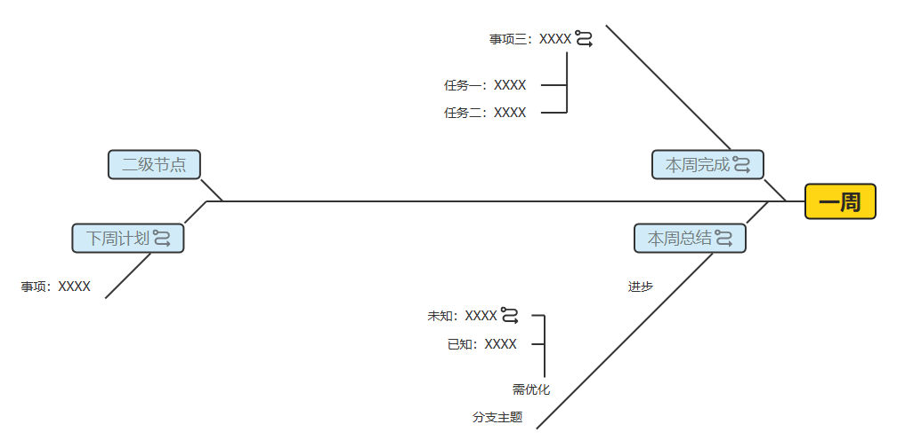
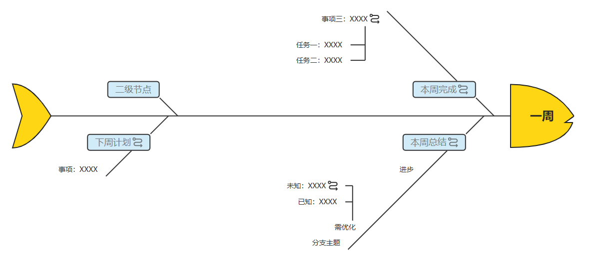

# RightFishbone 收费插件

> 适配v0.14.0及以上版本的simple-mind-map。

RightFishbone插件用于提供向右鱼骨图布局结构，包含两种：普通、带鱼头鱼尾形状：

<p style="display:flex;align-items: flex-end;">





</p>

你可以在在线版中在【结构】列表中切换进行体验。

## 收费

扫码转账备注你要购买的插件，以及你的邮箱地址（如果达到文字上限，那么你可以分两次付款），然后会将插件文件发送到你的邮箱。购买请在充分的使用和考虑后进行，如果你对前端开发不太熟悉，不知道如何使用插件，那么请谨慎考虑购买，没有特殊原因不会退费。如果你发现了 bug，或者有需求，可以提交相关的 issue。

价格：￥ 29.9，包含未打包的源码和打包后的文件。

> 一次性购买4个及以上收费插件打8折，心动不如行动~

<p style="display:flex;align-items: flex-end;">


</p>

## 注册

1.引用打包后的文件：

```js
import MindMap from 'simple-mind-map'
import RightFishbone from 'rightFishbone.cjs.min.js'
// 或 import RightFishbone from 'rightFishbone.esm.min.js'

MindMap.usePlugin(RightFishbone)
```

2.引用未打包的源码

可以先进入到插件目录执行：

```bash
npm link
```

然后进入到你的项目根目录执行：

```bash
npm link simple-mind-map-plugin-right-fishbone
```

然后就可以直接导入进行使用：

```js
import MindMap from 'simple-mind-map'
import RightFishbone from 'simple-mind-map-plugin-right-fishbone'

MindMap.usePlugin(RightFishbone)
```

注册完且实例化`MindMap`后可通过`mindMap.rightFishbone`获取到该实例。

## 使用

插件注册后就可以直接使用了，可以在实例化思维导图时传入结构：

- `rightFishbone`：普通的向右鱼骨图

- `rightFishbone2`：带鱼头鱼尾形状的鱼骨图

示例：

```js
const mindMap = new MindMap({
    layout: 'rightFishbone2'
})

// 动态切换
mindMap.setLayout('rightFishbone')
```